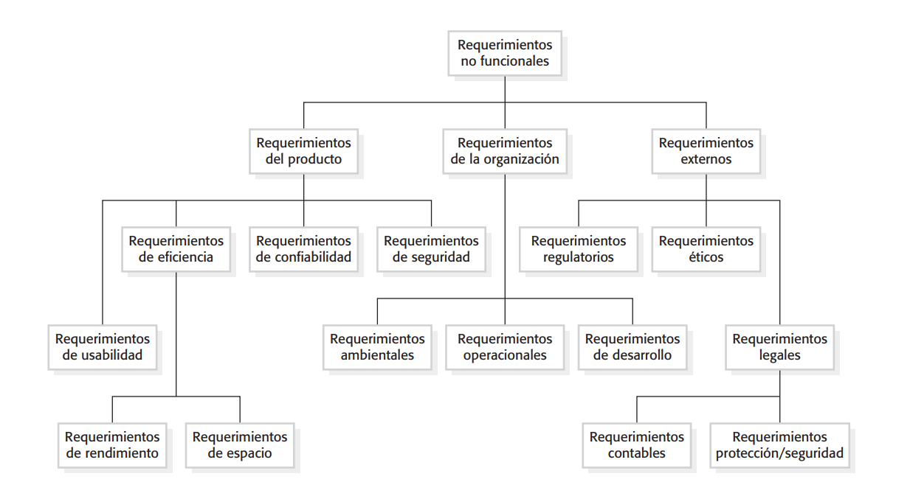

# Clase 3 - 31/8/2023

## Introducción

"Hasta ahora se habló del proceso software, de sus etapas y sus participantes. También de la importancia de detectar los errores lo antes posible. La última clase se abordó sobre qué es la gestión de requisitos y nos metimos en algunos modelos que describen la ingeniería de requisitos ( Somerville y Wiegers )" - Profesor

## Criterios para _clasificar_ a los requisitos

### Por proceso

Al ser un proceso existe una **entrada** y **salida**.

La entrada de la ingeniería de requisitos son los requisitos/requerimientos del cliente. Son las manifestaciones de lo que _desea_ el cliente.

La salida son los requisitos/requerimientos del sistema. Nosotros aplicaremos técnicas y estrategias para producir ese output. Una especificación orientado a lo técnico (precisa y detallada) de lo que el sistema debe hacer y sus límites que pueda tener.

    Para poder satisfacer los deseos del cliente lo haremos a través de una máquina que llamaremos sistema informático. Le va a permitir al cliente solucionar su problema o aprovechar una oportunidad que se le presente.

_El cliente generalmente no sabe lo que quiere y quizás el piensa que quiere algo y en realidad no lo necesita_.

### Por nivel de detalle

Cuando los requisitos están expresados en detalle serán llamados **requisitos de Bajo nivel**. En cambio cuando sean más abstractos y _por arriba_ serán **requisitos de Alto nivel**.

Alto nivel: ambigua, incompleta, imprecisa, la extensión es breve, no hay forma estructurada. Para qué sirven? tienen un objetivo: permitir de una forma rápida y sencilla introducirnos a la funcionalidad o la restricción que se necesita. Uno se hace una idea de lo que se trata el requisito.

Bajo nivel: sumamente detallado, documentación exhaustiva, puede tener un carácter contractual, es decir, que puede servir para el desarrollador y el cliente para saber si los requisitos están cubiertos o no.

Ejemplo profe: **SUBE**.

        Alto nivel: El sistema único de boleto electrónico sube deberá permitir abonar el costo de un viaje en un transporte público de pasajeros. (podrían ser mas cosas pero eso es lo ESENCIAL).

        Bajo nivel: Aquí estarán los datos que participan en el proceso, la funcionalidad, con ciertas restricciones que surjan. Abordará las alternativas, es decir, que pasa en un caso y en otro... y ciertos escenarios. Lenguaje estructurado y semiestructurado. No es una entrada sencilla, sino que busca brindar la mayor presición posible. Evita ambiguedades e imprecisiones. No es lo mismo un transporte ÓMNIBUS que un TREN. Considerar información como el número de tarjeta, el saldo disponible, el monto... El registro de la transacción... Casos que no se pueda abonar el viaje... Tener en cuenta descuentos por múltiples viajes en un rango horario...

Generalmente obtenemos del cliente los requisitos de alto nivel y nuestro trabajo será generar los de bajo nivel.

### Por funcionales / no funcionales

Un **requisito funcional** es algo que el sistema hace ó que _debe proveer_.

Ejemplo Sistema Horno/Microondas: El sistema deberá permitir calentar la comida. El sistema deberá permitir conocer la hora. Funcionalidad calentar, autolimpiar...

Ejemplo Sistema SUBE: Realizar una carga de saldo, obtener el listado personal de viajes. Deberá permitir pagar _refrigerios_ en máquinas expendedoras.

Es bueno recordar que... **un requisito es la formulación y exigencia de esa capacidad**.

Un **requisito no funcional** agrega información a la funcionalidad descrita anteriormente ó del sistema en general. Caracterizan/Condicionan a los requisitos funcionales ó al sistema completo. Un requisito no funcional puede detallar bajo qué circunstancias ó condiciones se va a desempeñar algo.

Ejemplo Ama de llaves: Que se encargue de resolver la limpieza de mi casa, efectuar los pedidos a los proveedores de almacén, abonar las cuentas de los impuestos... todo eso lo puede realizar mediante la acción de un ser humano ó a través de un sistema robótico que trabaja las 24hs... **digo el cómo se hace**.

    Importante destacar nuevamente que el requisito no funcional puede tratar acerca de un requisito funcional ó sobre el sistema general.

Un ejemplo de profe La Rosa acerca del sistema SUBE: "El sistema subé me deberá cobrar a través del sistema RFID" _(definición en **AQNC**)_. En este ejemplo se especifica cómo se cobrará (con bastante detalle, en bajo nivel).

Ahora el mismo requisito no funcional y de alto nivel podría ser "El sistema subé me deberá cobrar a través de una forma sin contacto y por proximidad". Esto probablemente lo generó un **_ingeniero de requisitos_** el cual no sabe tanto acerca de tecnologías que serán usadas, como la RFID.

Sommerville: "Muchas veces, cuando un sistema no satisface las funcionalidades el usuario encuentra otro camino para satisfacerlo". Como un atajo.

Ejemplo, quiero obtener un listado de alumnos pero en la plataforma no existe esa opción. Sin embargo, al querer generar un nuevo exámen en la plataforma se me despliegan todos esos alumnos y los logro obtener de ahí.

A veces hay requisitos no funcionales que si no se cumplen, por más que esté la funcionalidad, el sistema es obsoleto.

    Ejemplo profe SUBE
        Requisito funcional: Que el sistema me deje pagar
        Requisito no funcional: Que me permita pagar en no mas de 5 segundos

        En caso de no cumplirse el no funcional, ponele que tarda 1 minuto... el sistema es obsoleto.

    Por lo tanto a veces los requisitos no funcionales son más importantes que los funcionales.

## Cuadro de requisitos no funcionales (libro de Somerville, página 106)

_Se intenta representar a los requisitos no funcionales en algo mesurable, medible.
Para el funcional es fácil saber esto, **cumple o no cumple**. En cambio para los no funcionales se arma ese gráfico. Esto no quiere decir que todos los proyectos van a tener uno o más requerimientos no funcionales de cada tipo, sino que es a modo de reconocimiento del requerimiento._

Ejemplos de algunos:

- El sistema sube debe tener una tasa de fallos menor a ... 3%. -> Requerimiento de confiabilidad.

- De seguridad sería el sistema SUBE debe ser inmune a la copia de datos personales. Ambientales según la región donde se esté, como reaccionará al ambiente.

- De ambiental dijo: en el sistema SUBE no sería conveniente usar un teclado tipo PC para registrar la subida de cada pasajero ( o sea, estoy en un bondi y me muevo mucho... ambientalmente mal), dijo eso posta.

- Requisito organizacional de desarrollo ( es controversial según el profe ). El sistema SUBE se debe desarrollar en JAVA. ESO NO VA. Eso es muy específico. Ejemplo, **_según una ley, en Argentina todos los sistemas que use el Estado deben ser software libre_**.

- Requsitos regulatorios: cumplimiento de alguna ley o norma. El sistema SUBE debe respetar a la ley tal tal y tal de protección de datos personales (también podría ser de seguridad). Otro: puede ser que para tal sistema se aplique una ley que se prohiba tal transacción en cierta moneda, solo se admiten pesos o dólares, etc.

- Éticos: No necesariamente determinado por la ley o norma sino por valores y principios de la organización o del dominio. Ejemplo: un req. no funcional ético podría ser evitar la caracterización por género.

- Contables: obviamente tiene que ver con la contabilidad. El manejo de las transacciones de capital. Muchos requisitos legales por parte de la AFIP, la aduana, del Banco Central.

- Protección/Seguridad: medio repetido esto... dijo lo mismo de protección de datos personales.

**_Tener requisitos no funcionales mesurables de esta forma previene discusiones y malentendidos._**

## Reglas del dominio ó negocio

Por ejemplo, si digo el sistema SUBE manejará el transporte público de pasajeros en la **República Argentina**, estoy delimitando su territorio, su **_dominio_**.

Otro ejemplo, PedidosYa permite la compra y delivery de **_productos alimenticios_**. Hay reglas de ese dominio, por ejemplo, no se vende alcohol a menores de 18 años. No es un requisito, pero lo será si el sistema tiene que asegurar que no se venda alcohol a menores.

No quiere decir que el sistema tenga la obligación a seguir esas reglas. Un requisito es algo que se le **pide** al sistema.

## Elicitar y relevar

Técnicas en el proceso de adquisición del conocimiento.

Relevar según La Rosa es: se sienta una persona con otra y uno escucha y toma nota. Con el tiempo se profundizó esto, para no quedarse con poca información. No hay ser estáticos y quedarme con lo que el cliente diga. Tengo que descubrir nuevas necesidades y algo que no se haya pensado.

Hay una gran diferencia con elicitar, que es la actitud, el compromiso, ACTIVA, tratando de avanzar, la escucha activa (tomar notas y verificar conceptos).

    ¿Cómo se elicita?
    Tomando notas, repreguntando (Fantino: Para para para... ¿Vos me estas diciendo ...?), parafraseando...

Empatizamos con el usuario, me pongo en el lugar del otro, entiendo lo que le pasa.

### Extracción de información y educción

- Extracción es el proceso de recolección de información, tiene múltiples fuentes y ninguna de ellas es humana. Bibliografía, chequeo procesos, manuales, ver un sistema existente, el sistema de la competencia, entre otras.

- Educción es cuando nos cuentan las necesidades. Yo me siento con alguien y le digo: Contame lo que necesitas... Siempre del lado de la persona.

Si tengo que relevar algo nuevo, que no existe. Y hay otro que ya existe que quiere desarrollarse más, que quiere expandirse.

Lo que es nuevo seguramente esta en la mente de las personas que lo quieren desarrollar. Necesito usar la educción. En cambio cuando algo ya existe se usa la extracción.

Se dió a entender que se iba a trabajar con este tema la semana que viene... todo esta última parte la dió La Rosa en 25 min... como el orto posta, apurado. Quizás la clase 4 tiene la posta y tira cosas de esto.

## Glosario

> - Sistema Radio Frequency Identification (RFID) emite señales y en el contexto de la tarjeta SUBE, cuando ésta se acerca le devuelve un eco y ahí se efectúa.
>
> -

## Bibliografia

- [PPT Somerville](https://miel.unlam.edu.ar/data7/data2/contenido/3630/Ingenieria-de-Software---Somerville,-Ian---9---Edic.pdf)
- [Otro link](https://www.otro-link-clave.com/)
